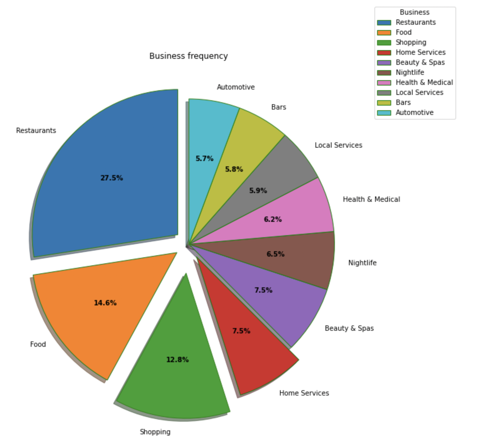

# Recommendation_system

This repo contains recommendation system algorithms used on yelp dataset for recommendating restaurants to users. The data is from metropolitan areas centered on Montreal, Calgary, Toronto, Pittsburgh, Charlotte, Urbana-Champaign, Phoenix, Las Vegas, Madison, and Cleveland as mentioned [here](https://www.yelp.com/dataset/documentation/faq)

Currently, we have:

**1. recommendation system using neural network embedding**

## Table of Contents
* [Motivation](#motivation)
* [About the dataset](#about-the-dataset)
* [A brief on recommendation systems](#a-brief-on-recommendation-systems)
* [Types implemented](#types-implemented)
  * [Recommendation system using neural network embedding](#1-recommendation-system-using-neural-network-embedding)
    * [Approach](#approach)
* [Result](#result)
* [Want to see if it works?](#want-to-see-if-it-works)
* [Future work](#future-work)
* [References](#references)

## Motivation

* Primary motivation for this project was to understand how recommendation systems work and are built.

* We also want to understand different algorithms used in developing recommender systems

* It was also intended to derive some business insights from the data at hand (yelp dataset) and make use of visualization    techniques for conveying   those insights.

## About the dataset

Data was taken from [Yelp](https://www.yelp.com/dataset/documentation/main)

All the extracted csv files can be found [here](https://drive.google.com/drive/folders/1sSEd8ohWqgjwC3TqPtBnLihbGeUwV1ac?usp=sharing)

## A brief on recommendation systems
Recommendation systems primarily deal with ordering products based on the predicted ranking or rating. These are the ratings which a user might give to a product.

Following are the types: 

1. Collaborative filtering based
2. Content Based
3. Hybrid systems

## Types implemented:

## 1. Recommendation system using neural network embedding

  First, let's understand what are **embeddings**.

  **Embedding** is mapping of discrete categorical variable to a variable having continous numbers.

  Why **neural network** embeddings?

  By using neural networks, we can reduce the dimensionality of categorical variables.

  It is an alternative method of **one hot encoding** categorical variables. In case of high cardinality of categorical variables, one hot encoding can highly increase the dimensions of the user-item interaction matrix.

  In our case, restaurant embeddings which we obtain will keep similarly rated restaurants closer to each other.

  This is brilliantly explained [here](https://towardsdatascience.com/neural-network-embeddings-explained-4d028e6f0526)

## Approach

* **Reading the data, exploring data and preprocessing**

  Through the above step, I was able to understand the context of the problem. The data is from metropolitan areas centered on Montreal, Calgary, Toronto, Pittsburgh, Charlotte, Urbana-Champaign, Phoenix, Las Vegas, Madison, and Cleveland, are included in the dataset.

  I could also find out about the missing values in the dataset. Understanding the context was important in filling null values.

  Some unnecessary columns were also dropped which were essentially conveying the same information. For example, addresses of businesses were dropped because we had latitude and longitude information available.

* **Exploratory data analysis**

  This step gave some business insight as in the restaurants which are have the highest average rating, regions with most businesses, out of all businesses, which business was the most common.

  Businesses could further analyze this information for making optimising resources.

  Some visualizations are as follows:

  **Types of businesses in the dataset**:

  

  
  

  **Cities with most businesses**

  

  
  

  
* **Implementation**

  
  
  
  I have created user_id and restaurant_id embeddings after label encoding them as the first step.
    
    Next step, we take the dot product of user embedding and restaurant embedding.
    
    We pass the output through sigmoid layer and then we normalize the rating values.
    
    We use Adam optimizer and mean_squared_error as our loss function.
    
    Here: point wise loss is calculated, we compare the actual rating in the training set and that calculated by our model and try to minimize the mse loss.
  
  
* Recommendation:

  We take the restaurant embeddings and normalize them.

  For finding restaurants similar to a particular restaurant, we take dot product of this restaurant's normalised embeddings with other embeddings (**cosine similarity**) and find the values which are higher.

## Result

Our loss function was MSE as we compared the predicted ratings with the actual rating.

After 5 epochs:

Train loss: 1.1973
Validation loss: 1.9868

**Embedding size=50**

## Want to see if it works?

The code for reading pickle files is already there in notebook, some important pickle files that will make running easier are [here](https://drive.google.com/drive/folders/1K_Binj3Ge0jxPt4g7TI0-uFKpReWtfGI?usp=sharing)

## Future work

I aim to add more algorithms for building recommendation system.

## References

This attempt would not have been possible without the following articles and posts:

1. https://towardsdatascience.com/neural-collaborative-filtering-96cef1009401
2. https://www.kaggle.com/code/aryansakhala/recommend
3. https://towardsdatascience.com/paper-review-neural-collaborative-filtering-explanation-implementation-ea3e031b7f96 
  
  

  

